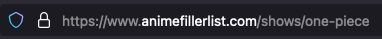

# SoFE (Sonarr Anime Filler Excluder)

The SoFE (Sonarr Anime Filler Excluder) is a Python application that configures Sonarr to monitor only non-filler anime episodes sourced from [AnimeFillerList](https://www.animefillerlist.com/). It also creates separate Plex collections for non-filler and filler episodes, depending on the download status.

## Features

- Fetch and expose information about filler episodes for various anime shows.
- Expose anime-related metrics for monitoring and analysis.
- Easy integration with Prometheus and Grafana for visualization and alerting.

## Prerequisites

- Sonarr
- Docker / Docker Compose
- Prometheus server setup for collecting metrics. (Optional)

> [!Note]
> Make sure to obtain the anime name from [Anime Filler List](https://www.animefillerlist.com/) URL.



## Installation

The SoFE can be easily run as a container. This section covers pulling the Container Image from the GitHub Container Registry and running it.

### Pulling the Container Image

To pull the latest version of SoFE, use the following command:
```sh
docker pull ghcr.io/chkpwd/sofe:latest
```
Run the container:
```sh
docker run --rm -p 7979:7979 \
  -e SONARR_URL="https://sonarr.local" \
  -e SONARR_API_KEY="<your_api_key>" \
  -e SONARR_SERIES_ID="187" \
  -e AFL_ANIME_NAME="one-piece" \
  -e PLEX_URL="http://127.0.0.1:32400" \
  -e PLEX_TOKEN="<your_plex_token>" \
  -e CREATE_PLEX_COLLECTION="True" \
  -e MONITOR_NON_FILLER_SONARR_EPISODES="True" \
  -e PLEX_ANIME_LIBRARY="<your_plex_anime_library>" \
  ghcr.io/chkpwd/sofe:latest
```
